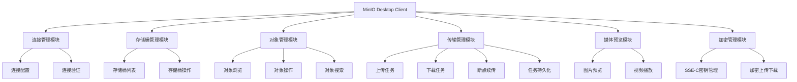
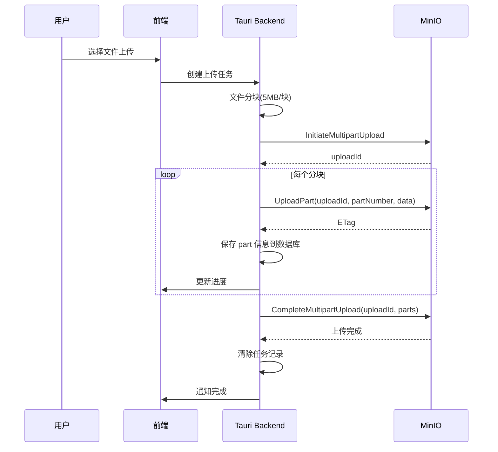
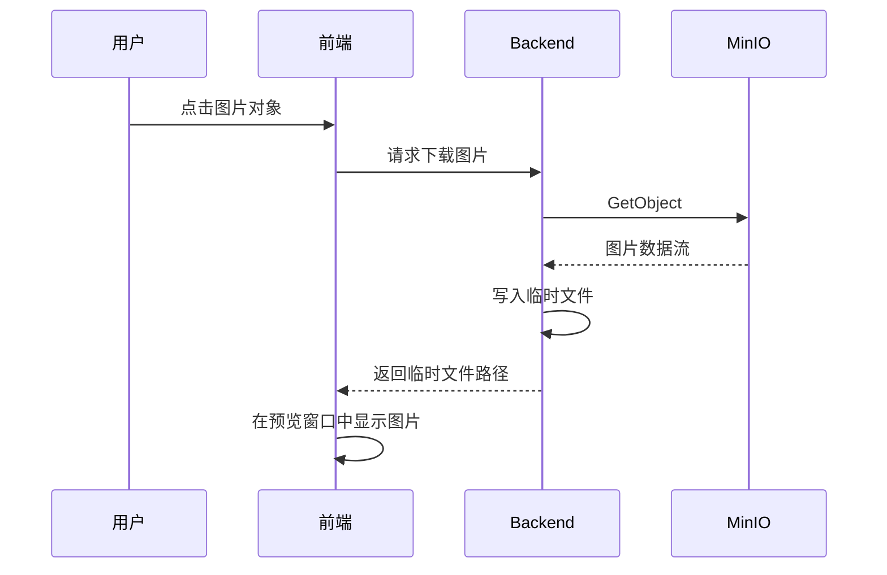
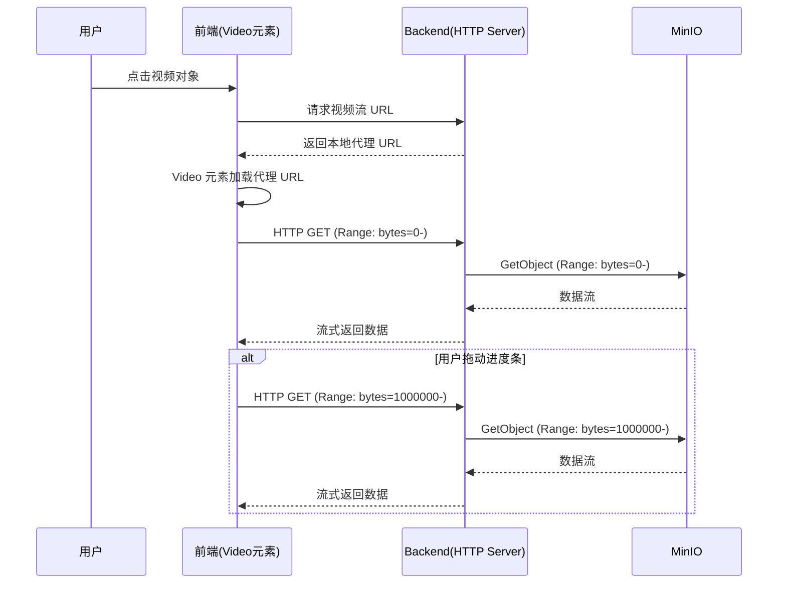
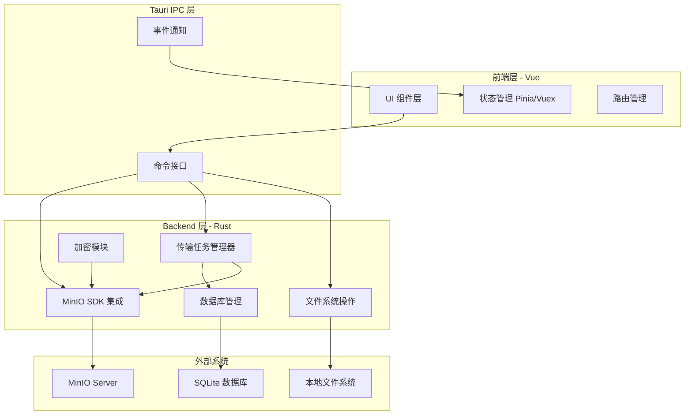
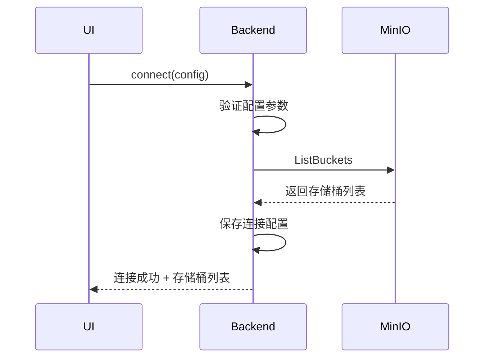
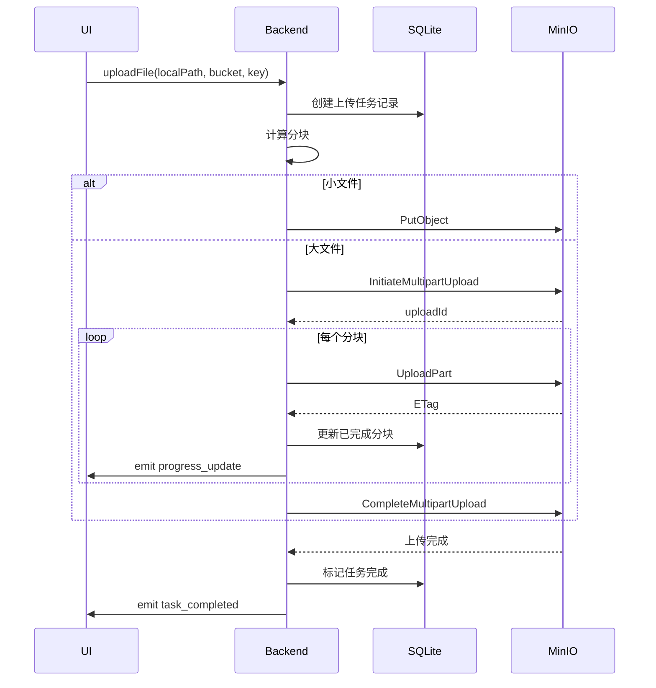

# MinIO Tauri Desktop 客户端设计文档

## 1. 项目概述

### 1.1 项目目标
构建一个基于 Tauri + Vue 的 MinIO 桌面客户端应用,提供完整的对象存储管理能力,支持加密存储、媒体预览、断点续传等高级功能,并针对 macOS 平台进行优化。

### 1.2 核心价值
- 提供原生桌面体验的 MinIO 对象存储管理工具
- 支持 SSE-C 客户端加密,保障数据安全
- 提供媒体文件预览和在线播放能力
- 通过断点续传机制提升大文件传输可靠性
- 跨会话恢复传输任务,提升用户体验

### 1.3 技术栈
- **前端框架**: Vue 3
- **桌面框架**: Tauri
- **目标平台**: macOS (可通过 `tauri build` 打包)

## 2. 功能架构

### 2.1 功能模块划分

## 3. 详细功能设计

### 3.1 连接管理模块

#### 3.1.1 连接配置
**功能目标**: 支持单个 MinIO 服务器连接配置的管理

**配置参数**:

| 参数名 | 类型 | 必填 | 说明 |
|--------|------|------|------|
| endpoint | 字符串 | 是 | MinIO 服务器地址 |
| port | 整数 | 是 | 服务端口 |
| accessKey | 字符串 | 是 | 访问密钥 |
| secretKey | 字符串 | 是 | 私密密钥 |
| useSSL | 布尔值 | 是 | 是否启用 SSL/TLS |

**存储策略**:
- 连接配置存储在本地加密存储中
- secretKey 需要进行额外加密保护
- 应用启动时自动加载上次保存的配置

#### 3.1.2 连接验证
**功能目标**: 在建立连接前验证配置的有效性

**验证流程**:
1. 参数格式验证(端口范围、URL 格式等)
2. 网络连通性测试
3. 凭证有效性验证(调用 MinIO ListBuckets API)
4. 返回验证结果和错误信息

### 3.2 存储桶管理模块

#### 3.2.1 存储桶列表
**功能目标**: 展示当前连接下的所有存储桶

**数据展示**:
- 存储桶名称
- 创建时间
- 对象数量统计(可选)
- 总容量统计(可选)

**交互行为**:
- 点击存储桶进入对象列表视图
- 支持刷新列表

#### 3.2.2 存储桶操作
**支持的操作**:
- 创建存储桶(输入名称,符合 MinIO 命名规范)
- 删除存储桶(需确认,仅允许删除空存储桶)
- 查看存储桶详情(策略、标签等元数据)

### 3.3 对象管理模块

#### 3.3.1 对象浏览
**功能目标**: 以文件夹树形结构展示存储桶内的对象

**视图设计**:
- 支持按前缀(prefix)进行层级导航
- 显示对象关键信息:名称、大小、最后修改时间、内容类型
- 区分文件夹和文件的视觉呈现
- 支持路径面包屑导航

**性能优化**:
- 分页加载(每页 100-500 条)
- 虚拟滚动优化大量对象展示
- 支持增量加载

#### 3.3.2 对象操作
**支持的操作**:

| 操作 | 说明 | 前置条件 |
|------|------|----------|
| 上传文件 | 单文件或多文件上传 | 有写权限 |
| 上传文件夹 | 递归上传整个文件夹 | 有写权限 |
| 下载文件 | 下载到本地指定目录 | 有读权限 |
| 删除对象 | 单个或批量删除 | 有删除权限 |
| 重命名 | 通过复制+删除实现 | 有读写删除权限 |
| 复制 | 在存储桶内或跨存储桶复制 | 有读写权限 |
| 移动 | 通过复制+删除实现 | 有读写删除权限 |
| 查看元数据 | 展示对象元数据信息 | 有读权限 |

#### 3.3.3 对象搜索
**功能目标**: 在当前存储桶内搜索对象

**搜索能力**:
- 按对象名称前缀搜索
- 按对象名称关键词过滤(前端过滤)
- 支持按文件类型筛选
- 支持按修改时间范围筛选

### 3.4 传输管理模块

#### 3.4.1 上传任务
**功能目标**: 管理文件上传任务,支持并发和断点续传

**上传策略**:
- 小文件(< 5MB): 使用单次 PUT 上传
- 大文件(≥ 5MB): 使用 S3 Multipart Upload

**Multipart Upload 流程**:

**并发控制**:
- 支持同时上传多个文件
- 每个文件的分块上传并发数: 3-5 个
- 可配置全局最大并发传输任务数

#### 3.4.2 下载任务
**功能目标**: 管理文件下载任务,支持断点续传

**下载策略**:
- 小文件(< 5MB): 单次下载
- 大文件(≥ 5MB): 分块下载,支持 Range 请求

**分块下载流程**:
- 获取对象总大小
- 将文件分成固定大小的块(5MB)
- 并发下载多个块(使用 HTTP Range 头)
- 按顺序写入本地临时文件
- 下载完成后移动到目标位置

#### 3.4.3 断点续传机制
**设计目标**: 在上传或下载中断后,能够从中断点继续传输

**持久化信息**:

| 字段 | 类型 | 说明 |
|------|------|------|
| taskId | 字符串 | 任务唯一标识 |
| taskType | 枚举 | upload / download |
| fileName | 字符串 | 文件名 |
| filePath | 字符串 | 本地文件路径 |
| bucketName | 字符串 | 目标存储桶 |
| objectKey | 字符串 | 对象键 |
| fileSize | 整数 | 文件总大小 |
| uploadId | 字符串 | Multipart Upload ID(上传任务) |
| completedParts | JSON 数组 | 已完成的分块信息 |
| totalParts | 整数 | 总分块数 |
| status | 枚举 | pending / running / paused / completed / failed |
| createdAt | 时间戳 | 创建时间 |
| updatedAt | 时间戳 | 更新时间 |

**恢复逻辑**:
- 上传恢复: 使用保存的 uploadId 和 completedParts,继续上传未完成的分块
- 下载恢复: 检查本地临时文件已下载字节数,继续下载剩余部分

#### 3.4.4 任务持久化
**存储方案**: 使用本地 SQLite 数据库存储传输任务信息

**持久化时机**:
- 任务创建时插入记录
- 每个分块完成后更新 completedParts
- 任务状态变更时更新 status
- 任务完成或取消后删除或标记记录

**启动恢复**:
- 应用启动时从数据库加载未完成任务
- 展示待恢复任务列表
- 用户可选择恢复或清除任务

### 3.5 媒体预览模块

#### 3.5.1 图片预览
**功能目标**: 点击图片对象时打开图片预览窗口

**支持格式**: 
- 常见格式: JPEG, PNG, GIF, WebP, BMP, SVG
- 判断依据: 对象的 Content-Type 或文件扩展名

**预览流程**:

**预览窗口功能**:
- 图片缩放(放大/缩小)
- 适应窗口大小
- 左右切换(浏览同目录其他图片)
- 下载到本地
- 查看元数据

**性能优化**:
- 对于小图片(< 10MB)直接加载
- 对于大图片先加载缩略图,再加载原图
- 使用缓存避免重复下载

#### 3.5.2 视频播放
**功能目标**: 点击视频对象时直接在线播放,无需下载到本地

**支持格式**:
- HTML5 video 支持的格式: MP4, WebM, Ogg
- 判断依据: Content-Type 或文件扩展名

**在线播放实现方案**:

**技术实现**:
- Backend 启动内置 HTTP 服务器(如使用 `axum` 或 `warp`)
- 为每个视频生成临时的代理 URL(如 `http://localhost:PORT/stream/[token]`)
- Backend 接收前端的 HTTP Range 请求
- Backend 将 Range 请求转发到 MinIO,获取对应字节范围的数据流
- Backend 将 MinIO 返回的数据流直接代理返回给前端,不落盘
- 前端 HTML5 video 元素直接加载代理 URL
- 浏览器自动发起 Range 请求,支持拖动进度条任意位置播放

**Range 请求处理**:
- 支持 HTTP Range 头部解析
- 支持部分内容响应(HTTP 206 Partial Content)
- 正确设置响应头:
  - `Content-Type`: 视频 MIME 类型
  - `Content-Length`: 内容长度
  - `Content-Range`: 字节范围信息
  - `Accept-Ranges`: bytes

**播放器功能**:
- 基础控制: 播放/暂停、音量、进度条
- 全屏播放
- 播放速度调节
- 支持任意拖动进度条(通过 Range 请求实现)
- 下载到本地(另外提供下载按钮)

**安全性考虑**:
- 代理 URL 包含临时 token,防止未授权访问
- token 有时效性(如 1 小时后过期)
- 关闭播放器时清理 token

**内存管理**:
- 数据流式传输,不占用大量内存
- 使用流式缓冲区(如 8KB-64KB)中转数据
- 播放结束后释放资源

### 3.6 加密管理模块

#### 3.6.1 SSE-C 密钥管理
**功能目标**: 管理用户提供的 SSE-C 加密密钥

**SSE-C 说明**:
- Server-Side Encryption with Customer-Provided Keys
- 用户提供 32 字节的加密密钥
- 密钥仅用于上传和下载操作,不存储在服务器端
- 每次请求需要提供密钥和密钥的 MD5 值

**密钥输入方式**:
- 手动输入 32 字节(256 位)密钥
- 从文件导入密钥
- 随机生成密钥并保存

**密钥存储**:
- 存储在应用的加密存储中
- 与连接配置关联
- 提供导出功能(导出到安全位置)

**安全性考虑**:
- 密钥在内存中加密存储
- 不在日志中记录密钥信息
- 提供密钥强度验证

#### 3.6.2 加密上传下载
**功能目标**: 在上传和下载时应用 SSE-C 加密

**应用范围**: 
- 仅在文件上传和下载操作中使用 SSE-C
- 列表、元数据等操作不涉及加密

**上传加密流程**:
1. 用户选择文件上传
2. 检查是否配置了 SSE-C 密钥
3. 如果配置了密钥,在上传请求中添加 SSE-C 相关头部:
   - `X-Amz-Server-Side-Encryption-Customer-Algorithm: AES256`
   - `X-Amz-Server-Side-Encryption-Customer-Key: <base64编码的密钥>`
   - `X-Amz-Server-Side-Encryption-Customer-Key-MD5: <密钥的MD5值>`
4. 执行上传操作

**下载解密流程**:
1. 用户下载加密对象
2. 如果对象使用了 SSE-C 加密,必须提供相同的密钥
3. 在下载请求中添加相同的 SSE-C 头部
4. MinIO 验证密钥后返回解密的数据

**Multipart Upload 加密**:
- InitiateMultipartUpload 时提供 SSE-C 头部
- 每个 UploadPart 请求都需要提供 SSE-C 头部
- CompleteMultipartUpload 时提供 SSE-C 头部

**用户体验**:
- 提供全局加密开关
- 上传前提示是否使用加密
- 下载加密对象时自动应用密钥
- 密钥不匹配时提供明确错误提示

## 4. 数据模型

### 4.1 连接配置数据模型

| 字段 | 类型 | 说明 |
|------|------|------|
| endpoint | 字符串 | MinIO 服务器地址 |
| port | 整数 | 端口号 |
| accessKey | 字符串 | 访问密钥 |
| secretKey | 字符串(加密) | 私密密钥 |
| useSSL | 布尔值 | 是否使用 SSL |
| lastConnected | 时间戳 | 最后连接时间 |

### 4.2 SSE-C 密钥数据模型

| 字段 | 类型 | 说明 |
|------|------|------|
| keyId | 字符串 | 密钥标识 |
| keyValue | 字符串(加密) | 32字节密钥 |
| keyMD5 | 字符串 | 密钥 MD5 值 |
| enabled | 布尔值 | 是否启用 |
| createdAt | 时间戳 | 创建时间 |

### 4.3 传输任务数据模型

| 字段 | 类型 | 说明 |
|------|------|------|
| taskId | 字符串 | 任务唯一标识(UUID) |
| taskType | 枚举 | upload / download |
| fileName | 字符串 | 文件名 |
| localPath | 字符串 | 本地文件路径 |
| bucketName | 字符串 | 存储桶名称 |
| objectKey | 字符串 | 对象键(包含路径) |
| fileSize | 整数 | 文件总大小(字节) |
| uploadId | 字符串 | Multipart Upload ID |
| partSize | 整数 | 分块大小(字节) |
| totalParts | 整数 | 总分块数 |
| completedParts | JSON 数组 | 已完成分块 [{ partNumber, ETag, size }] |
| transferredBytes | 整数 | 已传输字节数 |
| status | 枚举 | pending / running / paused / completed / failed / cancelled |
| errorMessage | 字符串 | 错误信息 |
| useEncryption | 布尔值 | 是否使用 SSE-C |
| createdAt | 时间戳 | 创建时间 |
| updatedAt | 时间戳 | 更新时间 |
| completedAt | 时间戳 | 完成时间 |

## 5. 系统架构

### 5.1 整体架构

### 5.2 前后端交互流程

**Tauri 命令模式**:
- 前端通过 `invoke` 调用 Backend 命令
- Backend 执行业务逻辑并返回结果
- 适用于: 连接验证、获取列表、对象操作等

**事件通知模式**:
- Backend 通过 `emit` 向前端发送事件
- 前端监听事件并更新 UI
- 适用于: 传输进度更新、任务状态变更等

### 5.3 核心交互流程

#### 5.3.1 连接建立流程

#### 5.3.2 文件上传流程

## 6. 技术实现要点

### 6.1 Tauri Backend 实现

**MinIO SDK 选择**:
- 使用 Rust 的 MinIO 客户端库或 AWS S3 SDK
- 推荐: `rust-s3` 或 `aws-sdk-s3`

**关键功能实现**:
- 连接管理: 创建和维护 MinIO 客户端实例
- 传输管理: 实现分块上传下载的任务调度器
- 进度报告: 使用 Tauri 事件系统实时推送进度
- 数据持久化: 使用 `rusqlite` 操作 SQLite 数据库
- 视频流代理: 实现 HTTP 服务器代理视频流(使用 `axum` 或 `warp`)

**并发处理**:
- 使用 `tokio` 异步运行时
- 使用 `tokio::sync::Semaphore` 控制并发数
- 使用 `tokio::task::spawn` 创建并发任务

**HTTP 服务器实现**:
- 使用 `axum` 或 `warp` 创建内置 HTTP 服务器
- 监听本地端口(如 localhost:随机端口)
- 实现 Range 请求处理中间件
- 实现 token 验证中间件
- 将 MinIO 数据流直接代理到 HTTP 响应

### 6.2 Vue 前端实现

**组件划分**:
- ConnectionConfig: 连接配置表单
- BucketList: 存储桶列表
- ObjectBrowser: 对象浏览器(树形或列表)
- TransferPanel: 传输任务面板
- ImageViewer: 图片预览组件
- VideoPlayer: 视频播放组件
- EncryptionSettings: 加密设置面板

**状态管理**:
- 使用 Pinia 管理全局状态
- 主要状态: 连接状态、当前存储桶、传输任务列表、SSE-C 配置

**交互优化**:
- 使用虚拟滚动优化大列表渲染
- 使用 debounce 优化搜索输入
- 使用乐观更新提升交互响应

### 6.3 数据持久化方案

**SQLite 数据库结构**:

**表: transfer_tasks**
- 存储传输任务的详细信息
- 索引: taskId(主键), status, createdAt

**表: connection_config**
- 存储连接配置(单条记录)
- 敏感信息加密存储

**表: encryption_keys**
- 存储 SSE-C 密钥
- 密钥值加密存储

**数据库位置**:
- macOS: `~/Library/Application Support/[AppName]/data.db`

### 6.4 文件系统操作

**临时文件管理**:
- 临时目录: 使用系统临时目录或应用专用缓存目录
- 命名规则: `[taskId]_[timestamp]_[filename]`
- 清理策略: 任务完成后清理,应用启动时清理过期文件
- 注意: 视频播放不使用临时文件,直接流式代理

**文件分块读写**:
- 使用缓冲读写提升性能
- 分块大小: 5MB (可配置)
- 使用内存映射(mmap)优化大文件操作

**视频流代理**:
- 使用小缓冲区(8KB-64KB)中转数据流
- 支持背压(backpressure)控制,避免内存溢出
- 连接断开时及时释放资源

### 6.5 错误处理

**错误分类**:
- 网络错误: 超时、连接失败、DNS 解析失败
- 认证错误: 凭证无效、权限不足
- 业务错误: 存储桶不存在、对象不存在、名称冲突
- 系统错误: 磁盘空间不足、文件权限错误

**错误处理策略**:
- 网络错误: 自动重试(指数退避),最多重试 3 次
- 认证错误: 提示用户重新配置连接
- 业务错误: 显示明确错误信息,引导用户操作
- 系统错误: 记录日志,提示用户检查系统环境

**用户反馈**:
- 使用 Toast 提示轻量级错误
- 使用 Modal 提示需要用户处理的错误
- 在传输任务中显示详细错误信息

## 7. 性能优化策略

### 7.1 网络传输优化
- 使用连接池复用 HTTP 连接
- 合理设置并发数避免过载
- 对于小文件批量上传,考虑打包后上传

### 7.2 UI 渲染优化
- 大列表使用虚拟滚动
- 图片懒加载和缩略图
- 使用 Web Worker 处理大数据计算

### 7.3 内存管理
- 及时释放已完成任务的内存
- 限制同时预览的媒体文件数量
- 流式处理避免大文件完整加载到内存
- 视频播放使用小缓冲区流式代理,典型内存占用 < 1MB/视频流
- 使用流式背压控制,避免生产者(MinIO)速度超过消费者(前端)导致内存堆积

### 7.4 缓存策略
- 缓存存储桶列表(短期缓存)
- 缓存对象元数据(避免重复请求)
- 缓存已下载的预览文件

## 8. 安全性设计

### 8.1 凭证安全
- 使用操作系统提供的安全存储(如 macOS Keychain)存储 secretKey
- 内存中的敏感信息及时清除
- 不在日志中记录完整凭证

### 8.2 加密密钥安全
- SSE-C 密钥加密存储
- 提供密钥导出和备份功能
- 密钥强度验证(至少 256 位)

### 8.3 网络安全
- 强制使用 HTTPS (useSSL=true 时)
- 验证服务器证书
- 支持自签名证书(开发环境)

### 8.4 文件安全
- 临时文件权限设置(仅当前用户可读写)
- 下载完成后验证文件完整性(ETag 校验)
- 清理遗留的临时文件

## 9. macOS 平台优化

### 9.1 原生体验
- 遵循 macOS Human Interface Guidelines
- 支持 macOS 原生菜单栏
- 支持拖拽上传(Drag & Drop)
- 支持快捷键操作

### 9.2 打包配置
- 使用 `tauri build` 生成 .app 和 .dmg
- 配置应用图标和元数据
- 代码签名和公证(分发时需要)

### 9.3 系统集成
- 支持 Finder 集成(右键菜单,可选)
- 使用 macOS 通知中心
- 支持系统深色模式

### 9.4 性能优化
- 利用 macOS 的文件系统特性
- 优化内存使用符合 macOS 应用标准
- 支持 Apple Silicon 原生编译

## 10. 用户界面设计原则

### 10.1 布局结构
- 左侧: 存储桶列表和导航
- 中间: 对象列表(主要工作区)
- 右侧/底部: 传输任务面板(可折叠)
- 顶部: 工具栏(连接、搜索、操作按钮)

### 10.2 交互设计
- 单击选中,双击打开(文件夹/预览)
- 右键菜单提供快捷操作
- 拖拽上传文件
- 进度条实时显示传输进度
- 支持多选批量操作

### 10.3 视觉设计
- 简洁现代的界面风格
- 清晰的视觉层次
- 文件类型图标区分
- 状态颜色编码(成功/失败/进行中)

## 11. 扩展性考虑

### 11.1 功能扩展点
- 未来可支持多连接切换
- 可添加更多对象存储服务支持(S3, OSS 等)
- 可扩展其他加密方式(SSE-S3, SSE-KMS)
- 可添加文件同步功能

### 11.2 配置扩展
- 传输参数可配置(分块大小、并发数)
- 界面主题可定制
- 快捷键可自定义

### 11.3 插件机制
- 预留插件接口用于未来扩展
- 支持自定义文件预览器
- 支持第三方工具集成

## 12. 测试策略

### 12.1 单元测试
- Backend 核心逻辑单元测试
- 前端组件单元测试
- 加密解密功能测试

### 12.2 集成测试
- MinIO 连接和操作集成测试
- 断点续传恢复测试
- 端到端上传下载测试

### 12.3 性能测试
- 大文件上传下载性能测试
- 大量对象列表性能测试
- 并发传输压力测试

### 12.4 兼容性测试
- 不同 MinIO 版本兼容性
- macOS 不同版本测试
- 不同文件类型和大小测试

## 13. 实施计划建议

### 13.1 第一阶段: 核心功能
- 连接管理和验证
- 存储桶列表和基本操作
- 对象浏览和基本上传下载
- 简单的传输任务管理

### 13.2 第二阶段: 高级传输
- 实现 Multipart Upload
- 实现断点续传
- 任务持久化和恢复
- 传输进度优化

### 13.3 第三阶段: 媒体预览
- 图片预览功能
- 视频流式播放
- 预览窗口优化

### 13.4 第四阶段: 加密和优化
- SSE-C 加密集成
- 性能优化
- macOS 平台优化
- 打包和分发

### 13.5 第五阶段: 完善和测试
- 全面测试
- 错误处理完善
- 用户体验优化
- 文档编写
### 12.4 兼容性测试
- 不同 MinIO 版本兼容性
- macOS 不同版本测试
- 不同文件类型和大小测试

## 13. 实施计划建议

### 13.1 第一阶段: 核心功能
- 连接管理和验证
- 存储桶列表和基本操作
- 对象浏览和基本上传下载
- 简单的传输任务管理

### 13.2 第二阶段: 高级传输
- 实现 Multipart Upload
- 实现断点续传
- 任务持久化和恢复
- 传输进度优化

### 13.3 第三阶段: 媒体预览
- 图片预览功能
- 视频流式播放
- 预览窗口优化

### 13.4 第四阶段: 加密和优化
- SSE-C 加密集成
- 性能优化
- macOS 平台优化
- 打包和分发

### 13.5 第五阶段: 完善和测试
- 全面测试
- 错误处理完善
- 用户体验优化
- 文档编写
